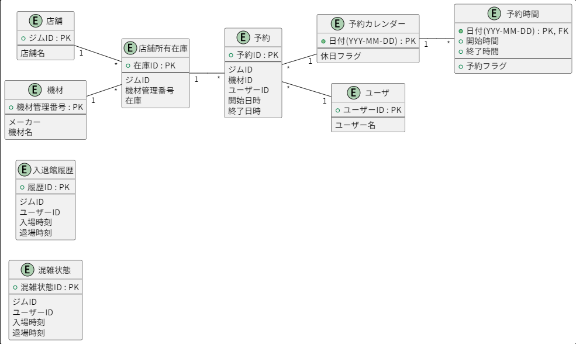

## 機能要件仕様

### 機能一覧

|   No  | 機能分類 | 機能名 | 機能概要 | 処理方式 | ユーザ区分 |
| --- | --- | --- | --- | --- | --- | 
|  1  | 入場者数管理 | リアルタイム入場者数表示機能 | ジム別現在の入場者数を取得できること。 | リアルタイム | 利用者 |
|  2  | 入場者数管理　|　リアルタイム入場者数追加機能 | ジム別現在の入場者数を追加できること。 | リアルタイム  | 利用者 |
|  3  | 入場者数管理　|　リアルタイム入場者数削除機能 | ジム入場後12時間経過した入場者はリアルタイム入場者数から減算する | リアルタイム  | 利用者 |
|  4  | 入場者数管理 | 入場者履歴登録機能 | 入場者履歴をデータベースに登録できること。 | リアルタイム  | 利用者 |
|  5  | 入場者数管理 | 入場者履歴表示機能 | 入場者履歴をデータベースから取得できること。 | リアルタイム | 利用者 |
|  6  | 機材予約機能 | 機材予約登録機能 | ジム.機材を利用を登録、更新、削除できること。 | リアルタイム | 利用者 |
|  7  | 機材予約機能 | 機材予約一覧機能 | 機材予約一覧を取得できること。（ユーザーに紐づく） | リアルタイム | 利用者 |
|  8  | マスタ管理 | 店舗マスタ登録機能 | 店舗マスタの登録、更新削除ができること。  | リアルタイム | 管理者 |
|  9  | マスタ管理 | 店舗マスタ登録機能 | 店舗マスタのデーターを取得できること。  | リアルタイム | 管理者 |
|  10  | マスタ管理 | 機材マスタ登録機能 | 機材マスタの登録、更新削除ができること。 | リアルタイム | 管理者 |
|  11  | マスタ管理 | 機材マスタ登録機能 | 機材マスタのデーターを取得できること。  | リアルタイム | 管理者 |
|  12  | マスタ管理 | ユーザー登録機能 | ユーザーの登録、更新削除ができること。 | リアルタイム | 管理者 |
|  13  | マスタ管理 | ユーザー登録機能 | ユーザーの登録、更新削除ができること。 | リアルタイム | 管理者 |

### 概念データモデル

### 概念データ一覧

| No  | 概念データ名   | 用途                       | 保存期間   | 備考 |
| --- | -------------- | -------------------------- | ---------- | ---- |
|  1  | 混雑状態       | 現在の入場者数、混雑状態の管理 | 6時間     |      |
|  2  | 入退館履歴     | 入退館履歴の管理            | 永久保存   |      |
|  3  | 予約           | ユーザの店舗・機材予約を管理  | 永久保存   |      |
|  4  | 予約カレンダー  | 予約可能な日付管理  | 永久保存   |      |
|  5  | 予約予約時間    | 予約の日時を管理  | 永久保存   |      |
|  6  | 店舗           | 店舗情報の管理              | 永久保存   |      |
|  7  | 機材           | 機材情報の管理              | 永久保存   |      |
|  8  | ユーザ         | ユーザー情報の管理           | 永久保存   |      |

### 概念データ定義

#### 混雑状態

| No  | データ項目名   | 型                         | 主キー  | 参照キー | 桁数 | データ概要 |
| --- | ------------ | -------------------------- | ---------- | ---- | ---- | ---- |
|  1  | 混雑状態ID    | 数値 | 〇 |  |      |      |
|  2  | ジムID    | 数値 |  |      |      |      |
|  3  | ユーザーID    | 数値 |  |      |      |      |
|  3  | 入場時刻      | DATETIME |  |      |      |      |
|  4  | 退場時刻      | DATETIME |  |      |      |      |

#### 混雑履歴

| No  | データ項目名   | 型                       | 主キー  | 参照キー | 桁数 | データ概要 |
| --- | ------------- | -------------------------- | ---------- | ---- | ---- | ---- |
|  1  | 混雑履歴ID     | 数値 | 〇 |      |      | 混雑履歴ID |
|  2  | ジムID      | 数値 |  |      |      | ジムID |
|  3  | ユーザーID      | 数値 | |      |      | ユーザーID |
|  4  | 入場時刻      | DATETIME | |      |      | ジムへの入場時刻 |
|  5  | 退場時刻      | DATETIME | |      |      | ジムへの退場時刻 |

#### 店舗

| No  | データ項目名   | 型                       | 主キー  | 参照キー | 桁数 | データ概要 |
| --- | ------------- | -------------------------- | ---------- | ---- | ---- | ---- |
|  1  | ジムID      | 数値 |  |      |      | ジムID |
|  2  | 店舗名      | 文字列 |  |      |      | 店舗名（ジム名） |

#### 機材

| No  | データ項目名   | 型                       | 主キー  | 参照キー | 桁数 | データ概要 |
| --- | ------------- | -------------------------- | ---------- | ---- | ---- | ---- |
|  1  | 機材管理番号   | 数値 |  |      |      | 社内の機材管理番号 |
|  2  | メーカー      | 文字列 |  |      |      | 機材のメーカ名 |
|  3  | 機材名      　| 文字列 | 6時間     |      |      | 機材名称 |

#### 店舗所有在庫

| No  | データ項目名   | 型                       | 主キー  | 参照キー | 桁数 | データ概要 |
| --- | ------------- | -------------------------- | ---------- | ---- | ---- | ---- |
|  1  | 在庫ID      | 数値 | 〇 |      |      | 在庫ID |
|  2  | ジムID      | 数値 | |      |      | ジムID |
|  3  | 機材管理番号 | 数値 | |      |      | 社内の機材管理番号 |
|  4  | 在庫  | 真偽値 | |      |      | 機材の予約可否 |

#### 予約

| No  | データ項目名   | 型                       | 主キー  | 参照キー | 桁数 | データ概要 |
| --- | ------------- | -------------------------- | ---------- | ---- | ---- | ---- |
|  1  | 予約ID | 数値 | 〇 |      |      | 予約ID |
|  2  | ジムID | 数値 | |      |      | ジムID |
|  3  | 機材ID | 数値 | |      |      | 機材ID |
|  4  | ユーザーID | 数値 |  |      |      | ユーザーID |
|  5  | 開始日時 | DATETIME |  |      |      | 予約の開始日時(YYYY-MM-DD HH:MM:SS) |
|  6  | 終了日時 | DATETIME |  |      |      | 予約の終了日時(YYYY-MM-DD HH:MM:SS) |

#### 予約カレンダー

| No  | データ項目名   | 型                       | 主キー  | 参照キー | 桁数 | データ概要 |
| --- | ------------- | -------------------------- | ---------- | ---- | ---- | ---- |
|  1  | 日付      | 日付型 | 〇 |  |      | 予約できるカレンダーの日付 |
|  2  | 休日フラグ | 真偽値 |  |      |      | ジムが休日の場合TRUE |

#### 予約時間

| No  | データ項目名   | 型                       | 主キー  | 参照キー | 桁数 | データ概要 |
| --- | ------------- | -------------------------- | ---------- | ---- | ---- | ---- |
|  1  | 日付      | DATE |  |      |      |      |
|  2  | 開始時間      | TIME | |      |      |      |
|  3  | 終了時間      | TIME | |      |      |      |
|  4  | 予約フラグ      | 真偽値 | |      |      |      |

#### ユーザー

| No  | データ項目名   | 型                       | 主キー  | 参照キー | 桁数 | データ概要 |
| --- | ------------- | -------------------------- | ---------- | ---- | ---- | ---- |
|  1  | ユーザーID      | 数値 |  |      |      | ユーザーID |
|  2  | ユーザー名      | 文字列 | |      |      | ユーザー名 |
